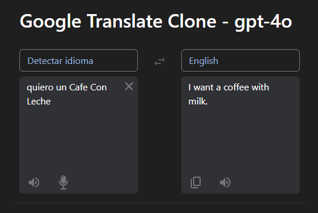
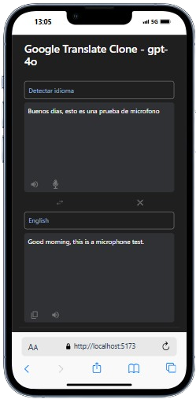

# Google Translator gpt - 4omini



This project is a React-based translation application that allows users to select source and target languages, input text for translation, and get real-time translations. Additional features include copying to the clipboard and reading aloud.


## Features

- Select source and target languages.
- Real-time translation of input text and voice.
- Swap source and target languages.
- Copy translation to the clipboard.
- Read input and output messages aloud.
- Microphone to detect voice and transcript it
- Button to clear the input text.

## Technologies Used

- **React:** Library for building user interfaces.
- **Bootstrap**: A popular CSS framework for designing responsive and mobile-first websites.
- **TypeScript:** A superset of JavaScript that adds static types.
- **Vite**: A fast build tool that provides a modern development environment.
- **ESLint**: A tool for identifying and fixing problems in JavaScript/TypeScript code.
- **happy-dom**: A lightweight DOM implementation for testing.

## Installation

To install and run this project on your local machine, follow these steps:

1. **Clone the repository:**

   ```bash
   git clone https://github.com/your-username/your-repository.git
   cd your-repository
2. **Install dependencies:**

   ```bash
   npm install
3. **Start the application in development mode:**

   ```bash
   npm start
This will open the application in your browser at http://localhost:3000.

## Project Structure

- **`src/`**: Main folder for the application's source code.
  - **`components/`**: Reusable React components.
    - **`Icons.tsx`**: Component with all icons.
    - **`LanguageSelector.tsx`**: A dropdown menu for selecting languages, with an option to detect the source language automatically.

    - **`TextArea.tsx`**: A styled text area component for inputting and displaying text. It adjusts its appearance based on whether it's used for source or target text and shows placeholders and loading states accordingly.

  - **`hooks/`**: Folder for custom hooks.
    - **`useDebounce.ts`**: A custom hook that delays updating the value by a specified amount of time (`delay`).
    - **`useStore.ts`**: A custom hook that manages the state and actions for the application using the `useReducer` hook. It provides methods for updating the state, including setting languages, text, results, and clearing text.

  - **`services/`**: Folder for custom services.
    - **`translate.ts`**:A function that uses OpenAI's API to translate text from one language to another. The function prepares a series of messages to instruct the AI model to perform the translation.

  - **`types.d.ts`**: TypeScript type definitions used throughout the application.
  - **`App.css`**: Global styles file.
  - **`main.tsx`**: Entry point of the React application where the root component is rendered.
  - **`App.tsx`**: Main component of the application.
  - **`App.test.tsx`**: Main component for testing the application.


## Usage

Simply input text for translation, typing or by voice, and get real-time translations in the selected language. You can select the input language or use the auto-detect mode


### Functionalities

#### Language Swap
The language swap button allows you to switch the source language with the target language and vice versa.
#### Clear Text
The clear text button appears only when there is text to clear and is positioned below the language swap button.
#### Read Aloud
The read-aloud button reads the translation using the SpeechSynthesis API.
#### Copy to Clipboard
The copy to clipboard button copies the translation to the system clipboard.
### Voice Input
The voice input functionality enables you to dictate text using your voice. Here's how it works:
- **Start Voice Input**: Click the microphone icon to begin voice input.
- **Speech Recognition**: The app uses the Web Speech API to convert your spoken words into text.
- **Error Handling**: If there are issues with the speech recognition, appropriate error messages will be displayed. Common errors include:
  - **Aborted**: The speech recognition process was aborted.
  - **No Speech**: No speech was detected.
  - **Audio Capture**: No audio capture device was found.
  - **Not Allowed**: Permission to use the microphone was denied.

## Contributing
Contributions are welcome! If you would like to contribute to this project, please follow these steps:

1. **Fork the repository.**
2. **Create a new branch for your changes:**

   ```bash
   git checkout -b your-branch-name
3. **Make your changes and commit:**

   ```bash
   git commit -am 'Add some feature'
4. **Push your changes to the remote repository:**

   ```bash
   git push origin your-branch-name
5. **Create a pull request on GitHub.**

## License
This project is licensed under the MIT License. See the LICENSE file for details.

## Links
- [GitHub Repository](https://github.com/AlvaroSapata/translator)
- [Live Application](https://translatorclone.netlify.app/)

## Contact
For any inquiries, please contact [alvaromfdv@gmail.com](mailto:alvaromfdv@gmail.com).

## References
- [React Documentation](https://reactjs.org/docs/getting-started.html)
- [TypeScript Documentation](https://www.typescriptlang.org/docs/)
- [Vite](https://vitejs.dev/)
- [React-Bootstrap](https://react-bootstrap.github.io/)
- [OpenAI API Reference](https://platform.openai.com/docs/api-reference)
- [ESLint](https://eslint.org/)
- [Vitest](https://vitest.dev/)
